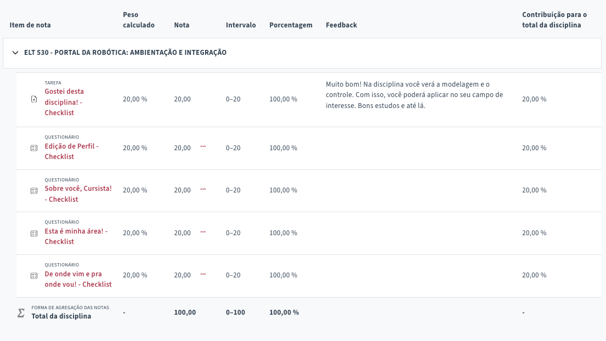

# ```ELT 530 - Portal da Robótica: Ambientação e Integração```

## Conteúdo:
1. Ambientação ao PVAnet Moodle
    1. Introdução ao ambiente virtual de aprendizagem da UFV.

## Avaliações:

| | # | Vencimento |  | Nota |
|:---:|:---:|:---:|:---|:---:|
| &check; | 1 | 28/09/2025 | Questionário: Edição de Perfil | 20 / 20 |
| &check; | 2 | 05/10/2025 | Questionário: Sobre você, cursista | 20 / 20 |
| &check; | 3 | 12/10/2025 | Questionário: Esta é minha área | 20 / 20 |
| &check; | 4 | 19/10/2025 | Questionário: De onde vim e pra onde vou | 20 / 20 |
| &check; | 5 | 26/10/2025 | Tarefa: Gostei desta disciplina | 20 / 20 |
| **Média Final** |  |  |  | **100 / 100** |


|  | Data |  |
|:---:|:---:|:---|
|  | 15/09/2025 | Aula inaugural |


---

1. Geral
1.1 Avisos $\varnothing$
1.2 Grupos de WhatsApp 
1.3 Encontros Síncronos

2. *Lato Sensu* em Robótica
2.1 Projeto Pedagógico
2.2 Ementa das Disciplinas
2.3 Minuta do Contrato

3. Sistemas da UFV
3.1 Sapiens
3.2 G-Suite da google

4. Ambientação ao PVANet Moodle

5. Atividades no PVANet Moodle

6. Avaliações

---

