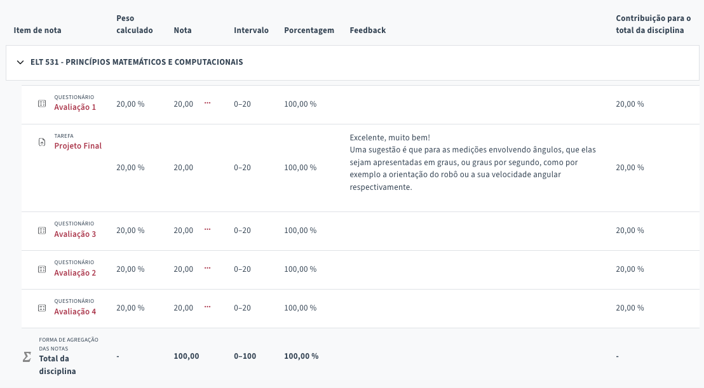

# ```ELT 531 - Princípios Matemáticos e Computacionais```


### Conteúdo
|  | # | Conteúdo |
|:---:|:---:|:---|
|  | 1 |  |

## Configuração de Softwares
- MatLab Online
- Google Colab

<br>

---


### Avaliações
|  | Avaliação | Nota |
|:---:|:---|:---:|
|  | [Avaliação 1](https://github.com/cintia-shinoda/ufv_robotica/blob/main/4_Principios-Matematicos-e-Computacionais/Avaliacoes/avaliacao-1.ipynb) | 20 / 20 |
|  | [Avaliação 2](https://github.com/cintia-shinoda/ufv_robotica/blob/main/4_Principios-Matematicos-e-Computacionais/Avaliacoes/avaliacao-2.ipynb) | 20 / 20 |
|  | [Avaliação 3](https://github.com/cintia-shinoda/ufv_robotica/blob/main/4_Principios-Matematicos-e-Computacionais/Avaliacoes/avaliacao-3.ipynb) | 20 / 20 |
|  | [Avaliação 4](https://github.com/cintia-shinoda/ufv_robotica/blob/main/4_Principios-Matematicos-e-Computacionais/Avaliacoes/avaliacao-4.ipynb) | 20 / 20 |
| &check; | [Trabalho Final](https://github.com/cintia-shinoda/ufv_robotica/blob/main/4_Principios-Matematicos-e-Computacionais/Projeto-Final/Projeto-Final.pdf) | 20 / 20 |
| **Média Final** |  | **100 / 100** |

<br>

---

### Encontros Síncronos
|  |  | Data |  |
|:---:|:---|:---:|:---|
|  | Teórica 1 |  02/03/2026 | Visão Geral de Princípios Matemáticos |
|  | Teórica 2 | 05/03/2026 | Fundamentos de Matemática |
|  |  | 10/03/2026 |  |
|  |  | 12/03/2026 |  |
|  |  | 16/03/2026 |  |
|  |  | 19/03/2026 |  |
|  |  | 24/03/2026 |  |
|  |  | 26/03/2026 |  |
|  |  | 30/03/2026 |  |
|  |  | 02/04/2026 |  |
|  |  | 06/04/2026 |  |
|  |  | 09/04/2026 |  |

----


