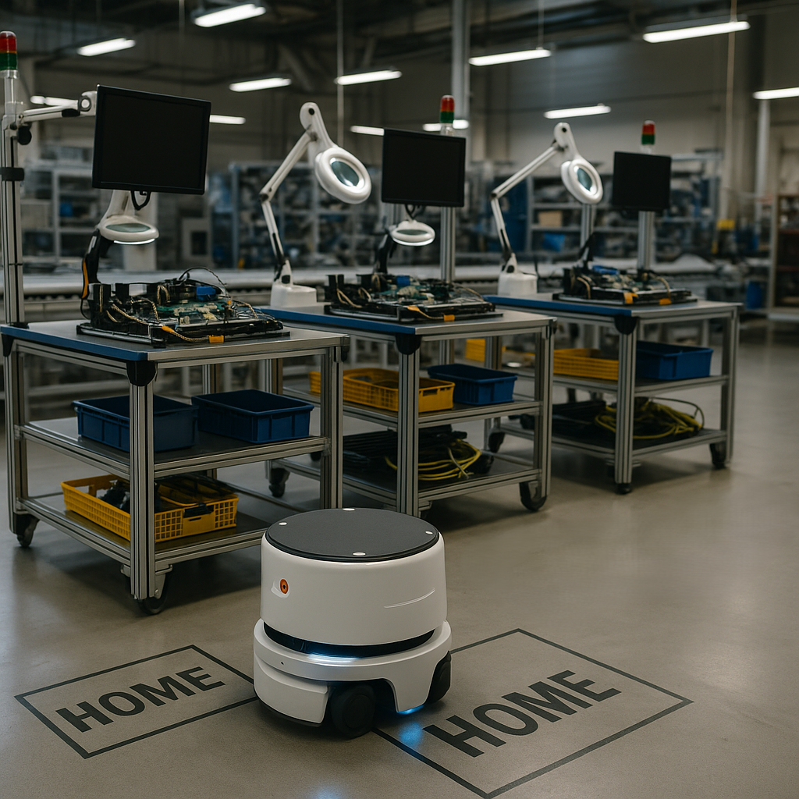
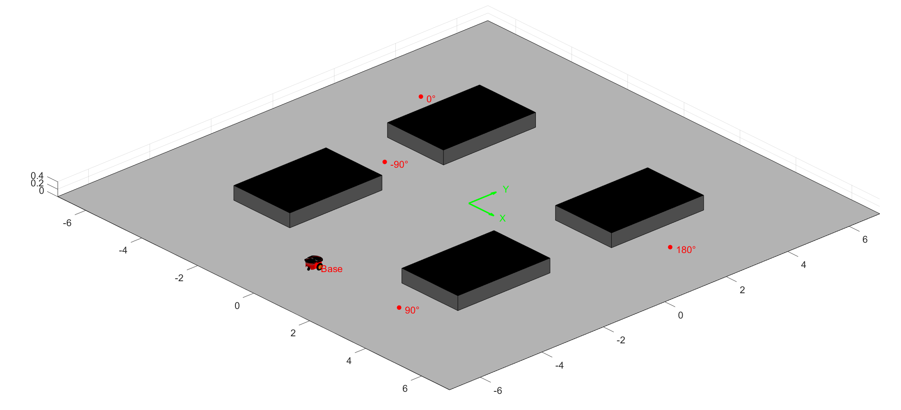
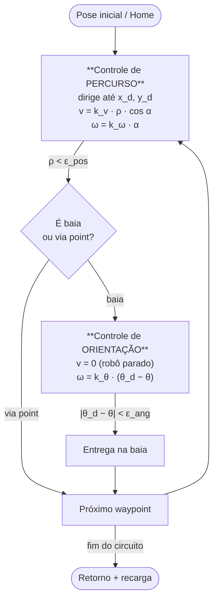

# Projeto Final — Controle de Robô Uniciclo em Linha de Montagem

Você foi contratado para projetar o sistema de controle de um robô terrestre autônomo em uma linha de montagem industrial. Este robô é do tipo uniciclo com tração diferencial, e sua principal função é realizar entregas de ferramentas e insumos entre quatro baias de produção, retornando depois ao ponto inicial, chamado de posição home, onde também realiza sua recarga.

Neste ambiente:

- As **posições e orientações finais** desejadas em cada baia são **previamente conhecidas**.
- O robô deve **seguir um circuito** pré-estabelecido: Home → Baia A → Baia B → Baia C → Baia D → Home.
- O robô precisa ajustar sua **orientação** para alinhar-se corretamente à baia antes de realizar cada entrega.
- Para realizar esse percurso com segurança, será necessário definir os **ganhos dos controladores** de orientação e de percurso. Além disso, é necessário planejar **quando** o robô deve realizar o controle de orientação (por exemplo, antes de chegar em uma baia ou ao sair dela).
 

A grade abaixo mostra a posição da base de recarga e das baias. O robô móvel deverá alcançar posições específicas em cada uma das baias, são elas:

- Baia A: (-3m, -0m, -90°)
- Baia B: (-5m, +3m, 0°)
- Baia C: (+5m, +2m, 180°)
- Baia D: (+3m, -5m, 90°)
- Base de Recarga: (0m, -5m, 90°)

Para solucionar o problema proposto, responda as questões a seguir: 

-----

> **Robô:** uniciclo com tração diferencial · **Tarefa:** entregas entre 4 baias com retorno à *home* (recarga).
> **Circuito:** `Home → Baia A → Baia B → Baia C → Baia D → Home`

### Poses-alvo (dados do enunciado)

| Ponto | X [m] | Y [m] | θ [graus] | Significado da orientação |
|---|---|---|---|---|
| Baia A | −3 | 0 | −90 | aponta para −y (sul), entra na baia |
| Baia B | −5 | +3 | 0 | aponta para +x (leste), entra na baia |
| Baia C | +5 | +2 | 180 | aponta para −x (oeste), entra na baia |
| Baia D | +3 | −5 | +90 | aponta para +y (norte), entra na baia |
| Base/Home | 0 | −5 | +90 | aponta para +y (norte) |

**Modelo cinemático do uniciclo** (usado em toda a solução):

$$\dot{x}=v\cos\theta,\qquad \dot{y}=v\sin\theta,\qquad \dot{\theta}=\omega$$

onde `v` é a velocidade linear e `ω` a velocidade angular (as duas únicas entradas de controle).

---

## 1. Desafios principais de controlar um uniciclo com rotas e orientações-alvo

O ponto central é que o uniciclo é um sistema **não-holonômico**: ele não desliza lateralmente (a velocidade no eixo do corpo perpendicular às rodas é nula). Isso impõe a restrição $\dot{x}\sin\theta-\dot{y}\cos\theta=0$, ou seja, **as três variáveis de pose (x, y, θ) não podem ser comandadas de forma independente no mesmo instante** — só temos duas entradas (`v`, `ω`) para três graus de liberdade configuracionais.

| # | Desafio | Origem | Consequência prática |
|---|---|---|---|
| 1 | Restrição não-holonômica | 2 entradas, 3 GDL de pose | Não dá para "ir de lado"; a orientação acopla com o caminho |
| 2 | Não-estabilizabilidade suave | **Teorema de Brockett** (resultado verificável da teoria de controle) | Não existe lei de realimentação suave, invariante no tempo, que estabilize a pose num ponto → exige **controle em fases** ou variante no tempo |
| 3 | Alvo é *pose*, não só posição | Cada baia exige (x, y **e** θ) | Posicionar não basta; precisa de uma etapa dedicada de orientação |
| 4 | Acoplamento `v`–`ω` | Curvas dependem das duas | Difícil obter trajetória suave sem coordenar as duas entradas |
| 5 | Singularidade perto do alvo | `α = atan2(Δy, Δx)` fica indefinido quando `ρ → 0` | *Chattering* / giros nervosos ao chegar na baia se não houver chaveamento |
| 6 | Saturação física | Limites de `v_max`, `ω_max` e aceleração do diferencial | Ganhos altos saturam o atuador e degradam a suavidade |
| 7 | Sem evasão de obstáculos | Premissa do enunciado | A **rota tem que ser segura por projeto** (planejamento offline) |
| 8 | Precisão de docagem industrial | Repetibilidade exigida na baia | Tolerâncias apertadas de posição e orientação no acoplamento |

> `[Inferência]` Em hardware real, o *drift* de odometria também é um desafio relevante, mas o enunciado não especifica sensoriamento, então trato a pose como conhecida (controle em malha fechada sobre o estado ideal).

---

## 2. Estrutura do controle — desacoplamento posição × orientação

A estratégia que resolve diretamente o desafio nº 2 (Brockett) é **desacoplar o controle em fases**, implementadas como uma **máquina de estados**. Em vez de uma única lei tentando convergir (x, y, θ) de uma vez, alternamos entre dois controladores:

### Lei de controle — Fase 1: PERCURSO (posição)

Erros em coordenadas polares relativas ao alvo:

$$\rho=\sqrt{(x_d-x)^2+(y_d-y)^2},\qquad \alpha=\text{wrap}\big(\operatorname{atan2}(y_d-y,\,x_d-x)-\theta\big)$$

$$\boxed{v = \min(k_v\,\rho,\;v_{max})\cdot\max(0,\cos\alpha)}\qquad \boxed{\omega=\operatorname{sat}(k_\omega\,\alpha,\;\pm\omega_{max})}$$

O termo $\cos\alpha$ faz o robô **"girar-então-andar"**: ele só avança quando já está razoavelmente apontado para o alvo, o que evita laços e curvas largas.

### Lei de controle — Fase 2: ORIENTAÇÃO (alinhamento final)

Ao chegar na baia, o robô **para a translação** (`v = 0`) e só gira até a orientação-alvo:

$$\boxed{v=0}\qquad \boxed{\omega=\operatorname{sat}\big(k_\theta\,(\theta_d-\theta),\;\pm\omega_{max}\big)}$$

| Fase | Objetivo | `v` | `ω` | Condição de saída |
|---|---|---|---|---|
| **Percurso** | chegar em (x_d, y_d) | `k_v·ρ·cos α` (saturado) | `k_ω·α` (saturado) | `ρ < ε_pos` |
| **Orientação** | alinhar `θ → θ_d` | `0` | `k_θ·(θ_d − θ)` (saturado) | `|θ_d − θ| < ε_ang` |

**Quando orientar:** o alinhamento dedicado ocorre **na chegada de cada baia** (antes da entrega). Os *via points* intermediários (usados para evitar colisão — ver pergunta 3) usam **apenas a fase de percurso**, sem alinhamento final, pois neles a orientação é irrelevante.

---

## 3. Garantir navegação sem colisão (sem evasão de obstáculos)

Como o robô **não tem** evasão reativa, a colisão é evitada por **planejamento de rota offline** — o caminho é seguro por construção. Princípios aplicados:

1. **Espaço de configuração (C-space):** inflar cada baia pela soma `(meia-largura do robô + margem de segurança)`. Validar que nenhum segmento da rota intersecta os retângulos inflados.
2. **Via points (waypoints intermediários):** inserir pontos de passagem que mantêm o robô no **corredor livre** (periferia da célula + região central junto à origem, que é vazia).
3. **Aproximação pela face correta:** chegar a cada baia pelo lado aberto, coerente com a orientação de docagem (a face onde o robô entra).
4. **Velocidade baixa perto da baia:** como `v = k_v·ρ`, a velocidade cai naturalmente ao se aproximar, reduzindo risco de impacto.
5. **Ordenação do circuito:** percorrer a periferia (sul → oeste → topo → leste → sul) para nunca cruzar a região central ocupada pelas baias.

### Rota projetada (livre de colisão)

> `[Inferência]` As dimensões exatas das baias não constam no enunciado; estimei retângulos a partir da figura (robô entra de frente na baia). A rota abaixo mantém margem em todos os trechos.

| Trecho | De → Para | Estratégia de clearance |
|---|---|---|
| 1 | Home (0,−5) → via (−4,−4.5) → via (−5,−0.5) | desce ao sul das baias e sobe pela borda oeste |
| 2 | → **Baia A** (−3, 0) | aproxima por cima/oeste (face norte da baia A) |
| 3 | → via (−6, 1) → **Baia B** (−5, 3) | contorna pela borda oeste (face oeste da baia B) |
| 4 | → via (−6, 4.3) → via (6, 4.3) | **corredor superior** (y ≈ 4.3, acima de todas as baias) |
| 5 | → **Baia C** (5, 2) | desce pela borda leste (face leste da baia C) |
| 6 | → via (6, −6) → **Baia D** (3, −5) | desce pela borda leste e aproxima pelo sul (face sul da baia D) |
| 7 | → Home (0, −5) | retorno reto pela borda sul (y = −5) |

O resultado é um **laço perimetral**: o robô nunca corta o miolo da célula onde estão as baias.

---

## 4. Critérios para ajustar os ganhos (comportamento suave, seguro e eficiente)

| Ganho | Papel | Se **alto demais** | Se **baixo demais** | Critério de ajuste |
|---|---|---|---|---|
| `k_v` (linear) | velocidade de aproximação | satura `v_max`, *overshoot*, colisão | robô lento | rápido sem ultrapassar; `ρ` já desacelera no fim |
| `k_ω` (angular, percurso) | direcionamento ao alvo | oscilação/zigue-zague | curvas largas, laços | **deve dominar `k_v`**: girar antes de andar |
| `k_θ` (orientação final) | alinhamento na baia | tremor no alinhamento | docagem lenta | resposta **criticamente amortecida**, sem oscilar |
| `v_max`, `ω_max` | saturação física | — | — | respeitar limites do atuador → suavidade e segurança |
| `ε_pos`, `ε_ang` | tolerâncias de chaveamento | imprecisão na baia | *chattering* perto do alvo | apertado o suficiente para docar, sem travar |

**Critérios práticos:**

- **Convergência angular mais rápida que a linear** (`k_ω` domina `k_v`) → o robô se alinha antes de avançar, evitando trajetórias com laço. É o que o termo `cos α` reforça.
- **Sem *overshoot*:** preferir resposta criticamente amortecida; reduzir `k` ~20% ao primeiro sinal de oscilação.
- **Respeitar saturações:** ganho que satura constantemente o atuador prejudica a suavidade — limitar `v`, `ω` e, idealmente, a aceleração.
- **Tolerâncias de chaveamento:** trade-off direto precisão (apertar) × *chattering* (afrouxar).

**Referência teórica (controlador clássico em coordenadas polares — Siegwart, *Introduction to Autonomous Mobile Robots*):** para a lei $v=K_\rho\rho,\;\omega=K_\alpha\alpha+K_\beta\beta$, as condições de estabilidade local são:

$$K_\rho>0,\qquad K_\beta<0,\qquad K_\alpha-K_\rho>0$$

ou seja, o ganho de direcionamento deve superar o ganho de avanço — formalizando a heurística "girar-então-andar".

### Ganhos usados na simulação

| Parâmetro | Valor | Parâmetro | Valor |
|---|---|---|---|
| `k_v` | 0.8 | `v_max` | 0.6 m/s |
| `k_ω` | 2.0 | `ω_max` | 1.5 rad/s |
| `k_θ` | 2.5 | `dt` | 0.05 s |
| `ε_pos` (baia) | 0.05 m | `ε_ang` | 1° |

---

## 5. Rota realizada pelo robô

O robô parte da *home* (0, −5, 90°) e executa o laço perimetral `Home → A → B → C → D → Home`, alinhando-se à orientação-alvo em cada baia antes da entrega. **Tempo total simulado: ≈ 108,6 s**, com erro de orientação final **< 1°** em todas as 5 docagens.

### Navegação no plano XY

*As setas vermelhas indicam a orientação final em cada baia: A↓ (−90°), B→ (0°), C← (180°), D↑ (90°), Home↑ (90°). A trajetória contorna todas as baias sem colisão.*

### Evolução temporal de X

### Evolução temporal de Y

### Evolução temporal de θ

*Os patamares correspondem às fases de orientação (robô parado girando para `θ_d`); as rampas, ao deslocamento de percurso.*

---

## 6. Sinais de controle aplicados ao robô

As duas entradas do uniciclo são a **velocidade linear `v`** e a **velocidade angular `ω`**. Observa-se o padrão característico do controle em fases:

- **Picos de `ω` com `v ≈ 0`** → fases de orientação pura (alinhamento na baia / giro inicial para o próximo alvo).
- **`v > 0` com `ω` pequeno** → trechos de percurso já alinhados.
- Nenhum sinal ultrapassa as saturações (`v ≤ 0.6 m/s`, `|ω| ≤ 1.5 rad/s`), garantindo viabilidade física e suavidade.

### Velocidade linear v(t)

### Velocidade angular ω(t)

---

### Rótulos epistêmicos

- `[Inferência]` Dimensões/posições dos retângulos das baias estimadas da figura (não constam no enunciado).
- **Verificável:** modelo cinemático, teorema de Brockett, condições de estabilidade do controlador polar (Siegwart).
- **Resultado da simulação:** rota, tempos, erros e gráficos são saídas da implementação descrita (parâmetros na tabela da pergunta 4) — reproduzíveis com os mesmos ganhos.
